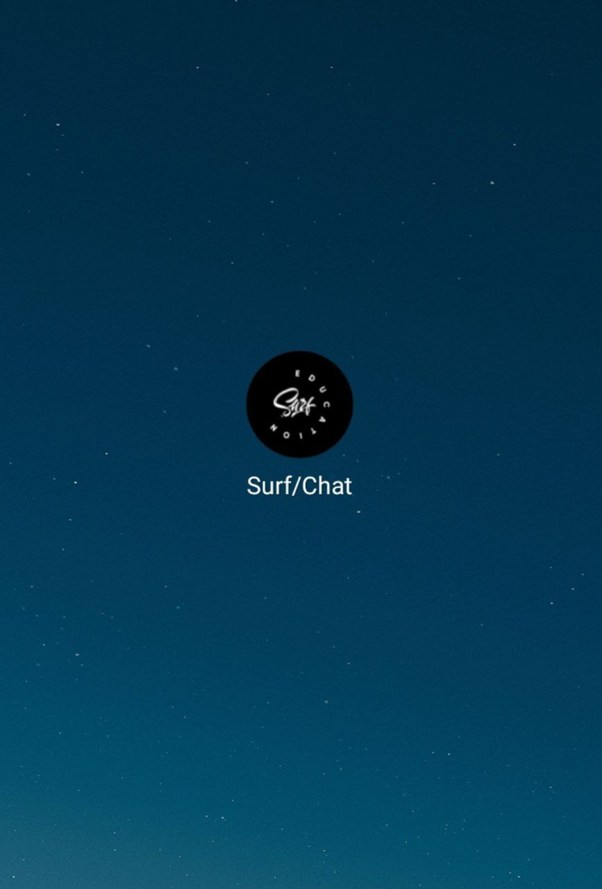
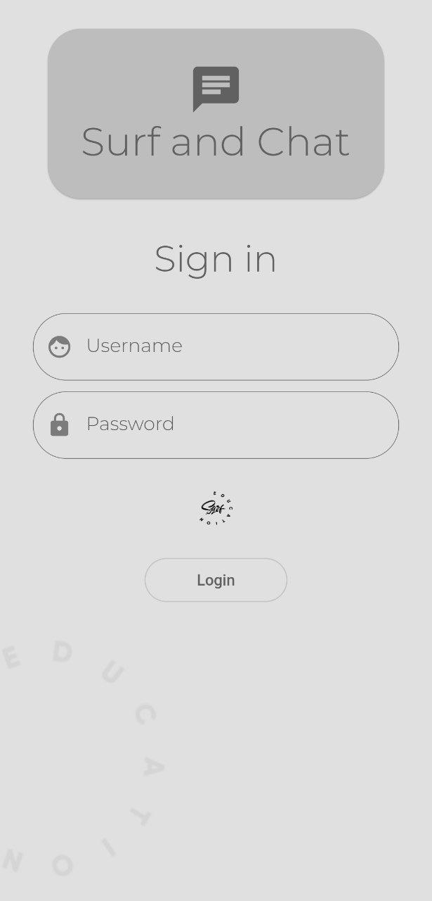
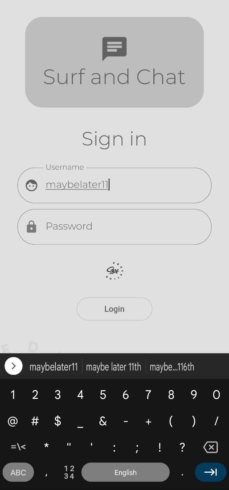
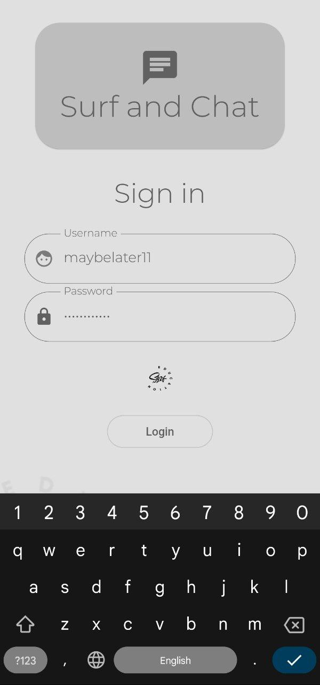
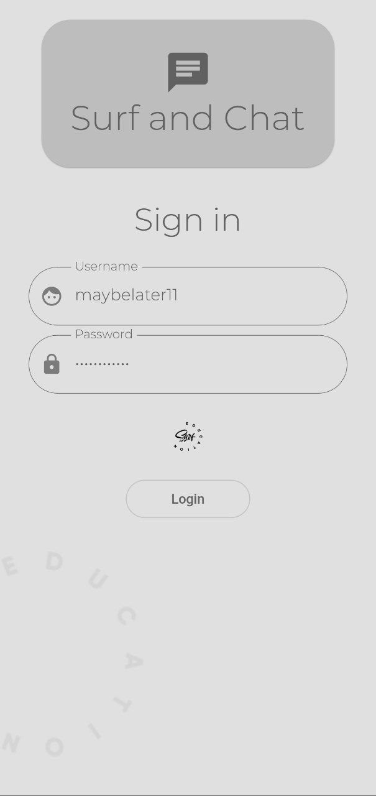
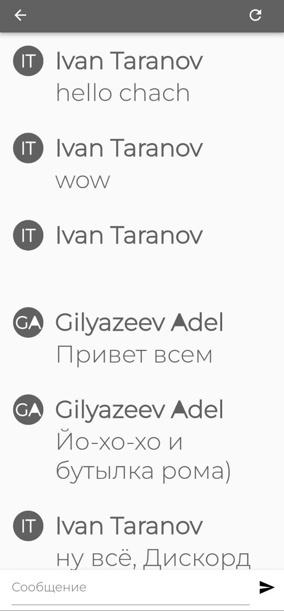

Целевая платформа

Android

Результаты

Это мой первый опыт работы с Flutter. Сразу поставил цель попытаться реализовать
экран авторизации используя Elementary.

Экран авторизации:
Сделал простой экран авторизации, реализовал для него дизайн, немного изменил стандартную тему.
Также добавил методы textInputAction: TextInputAction.next/done.
Логин и пароль получаю в TextField, отправляю из него в WidgetModel, а из него уже в Model, там при
успешном входе сохраняю токен в SecureStorage. Пробую получить токен в WidgetModel, если успешно,
открываю экран чата, в против случае нужно обработать ошибку, к сожалению, я не успел. Так же хотелось 
реализовать анимацию вращения картинки под паролем во время входа, тоже не успел.

Поработать с остальными экранами времени, к сожалению, не хватило

  
  